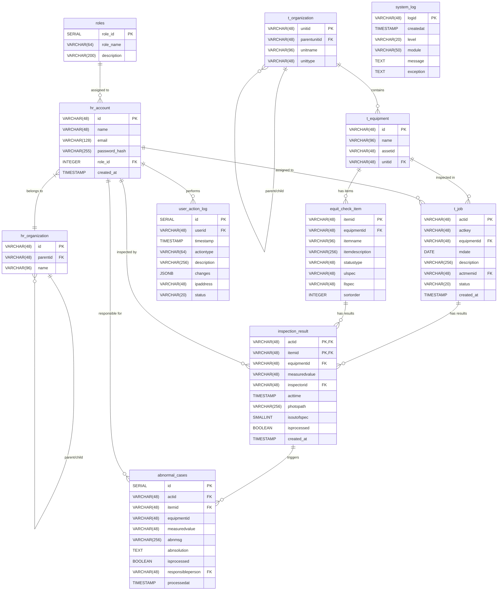

# 資料庫關聯圖 (Database Relationship Diagram)

本文件描述 FEM 系統的資料庫實體關聯圖 (ER Diagram) 與詳細關聯說明。

## ER Diagram (Mermaid)

## ER Diagram (Mermaid)

## 關聯說明 (Relationships Description)

### 1. 組織與人員 (Organization & Users)
*   **hr_organization (Self-Reference)**: 組織表透過 `parentid` 關聯自身，形成樹狀組織結構。
*   **hr_organization -> hr_account**: 一個組織 (`id`) 可以包含多個使用者 (`hr_account`)。關聯並非強制外鍵，而是業務邏輯關聯。
*   **roles -> hr_account**: 一個角色 (`role_id`) 可以分配給多個使用者 (`id`)。詳細權限邏輯保留於應用層。

### 2. 設施與設備 (Facilities & Equipment)
*   **t_organization (Self-Reference)**: 設施表透過 `parentunitid` 關聯自身，形成樹狀設施結構 (例如：廠區 -> 樓層 -> 區域)。
*   **t_organization -> t_equipment**: 一個設施 (`unitid`) 可以包含多個設備 (`id`)。
*   **t_equipment -> equit_check_item**: 一個設備 (`id`) 擁有多個檢查項目 (`itemid`)。

### 3. 巡檢任務與結果 (Inspection Tasks & Results)
*   **t_equipment -> t_job**: 針對一個設備 (`id`) 可以建立多個巡檢任務 (`actid`)。
*   **hr_account -> t_job**: 一個任務 (`actid`) 指派給一個負責人 (`actmemid`)。
*   **t_job -> inspection_result**: 一個任務 (`actid`) 包含多個檢查項目的結果。
*   **equit_check_item -> inspection_result**: 每個結果對應一個檢查項目 (`itemid`)。
*   **hr_account -> inspection_result**: 每個檢查結果記錄了實際檢查人員 (`inspectorid`)。

### 4. 異常追蹤 (Abnormal Tracking)
*   **inspection_result -> abnormal_cases**: 異常追蹤記錄關聯到特定的巡檢結果 (`actid`, `itemid`)。
*   **hr_account -> abnormal_cases**: 異常追蹤由特定的負責人 (`responsibleperson`) 處理。

### 5. 系統日誌 (Logs)
*   **hr_account -> user_action_log**: 使用者 (`userid`) 的操作行為被記錄在使用者日誌中。
*   **system_log**: 獨立的系統日誌，無直接的外鍵關聯，用於記錄系統層級事件。
